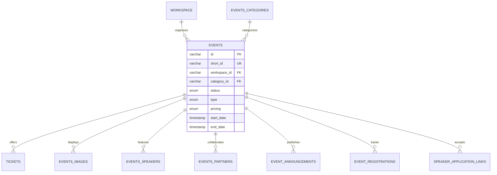

## Overview

Events are the core entity in EventPalour. Each event belongs to a workspace and can be configured as online, physical, or hybrid with various status states and pricing models.

## Event Schema

The `events` table contains comprehensive event information:

| Field | Type | Description |
|-------|------|-------------|
| `id` | varchar(16) | Unique event identifier |
| `short_id` | varchar(6) | 6-character short ID for URLs (unique) |
| `title` | varchar(255) | Event title |
| `description` | text | Full event description |
| `workspace_id` | varchar(16) | Owner workspace (foreign key) |
| `category_id` | varchar(16) | Event category (foreign key) |
| `status` | event_status_enum | Current status (default: "active") |
| `type` | event_type_enum | Event type (default: "physical") |
| `pricing` | event_pricing_enum | Pricing model (default: "free") |
| `venue` | text | Physical location details |
| `country` | text | Country |
| `city` | text | City |
| `online_link` | text | Meeting link for online/hybrid events |
| `queue_counter` | integer | Waitlist counter (default: 0) |
| `start_date` | timestamp | Event start time (with timezone) |
| `end_date` | timestamp | Event end time (with timezone) |
| `is_recurring` | boolean | Recurring event flag (default: false) |
| `recurrence_pattern` | varchar(32) | Pattern (e.g., "weekly", "monthly") |
| `recurrence_days` | text | Comma-separated or JSON string of days |
| `created_at` | timestamp | Creation timestamp |
| `updated_at` | timestamp | Last update timestamp |

## Event Types

EventPalour supports three event delivery models:

<CardGroup cols={3}>
  <Card title="Online" icon="video">
    Virtual events conducted entirely online. Requires `online_link` field.
  </Card>
  <Card title="Physical" icon="location-dot">
    In-person events at a physical venue. Requires `venue`, `city`, and `country` fields.
  </Card>
  <Card title="Hybrid" icon="diagram-project">
    Both online and physical attendance options. Requires both location and meeting link.
  </Card>
</CardGroup>

```typescript
// From /lib/db/schema/enums.ts:29-33
enum EventType {
  ONLINE = "online",
  PHYSICAL = "physical",
  HYBRID = "hybrid"
}
```

## Event Status

Events transition through different statuses during their lifecycle:

<Steps>
  <Step title="Active">
    Event is live and accepting registrations/ticket sales.
  </Step>
  <Step title="Inactive">
    Event is hidden and not accepting new registrations.
  </Step>
  <Step title="Postponed">
    Event is delayed to a future date. Original details preserved.
  </Step>
  <Step title="Canceled">
    Event is permanently canceled. May trigger refund workflows.
  </Step>
</Steps>

```typescript
// From /lib/db/schema/enums.ts:35-40
enum EventStatus {
  ACTIVE = "active",
  INACTIVE = "inactive",
  CANCELED = "canceled",
  POSTPONED = "postponed"
}
```

<Warning>
Changing event status to `canceled` may have financial implications for paid events. Ensure proper refund handling is in place.
</Warning>

## Pricing Models

Events can be configured as free or paid:

| Pricing | Description | Use Case |
|---------|-------------|----------|
| **Free** | No payment required | Community meetups, public talks, open events |
| **Paid** | Requires ticket purchase | Conferences, workshops, premium events |

```typescript
// From /lib/db/schema/enums.ts:54-57
enum EventPricing {
  FREE = "free",
  PAID = "paid"
}
```

<Info>
For free events, use the `event_registrations` table to track attendees. For paid events, use the `tickets` and `purchased_tickets` tables.
</Info>

## Event Categories

Categories help organize events within a workspace. The `events_categories` table:

```typescript
{
  id: varchar(16),              // Category ID
  workspace_id: varchar(16),    // Owner workspace
  name: varchar(255),           // Category name (e.g., "Tech Talks", "Workshops")
  created_at: timestamp,
  updated_at: timestamp
}
```

<Note>
Categories are workspace-scoped. Each workspace defines its own category taxonomy.
</Note>

## Event Relationships



## Related Entities

### Event Images

Store multiple images per event in `events_images` table:

```typescript
{
  id: varchar(16),
  event_id: varchar(16),        // Foreign key to events
  // Image URL stored separately in cloud storage
}
```

### Event Speakers

Manage speaker information with the `events_speakers` table:

| Field | Type | Description |
|-------|------|-------------|
| `id` | varchar(16) | Speaker ID |
| `event_id` | varchar(16) | Associated event |
| `name` | varchar(255) | Speaker name |
| `email` | varchar(255) | Contact email |
| `title` | varchar(255) | Professional title (e.g., "Senior Engineer") |
| `talk` | text | Talk/presentation topic |
| `bio` | text | Speaker biography |
| `image_url` | text | Profile image URL |
| `twitter_handle` | varchar(255) | X/Twitter handle |
| `linkedin_url` | text | LinkedIn profile |
| `instagram_handle` | varchar(255) | Instagram handle |
| `status` | speaker_status_enum | Approval status (default: "pending") |
| `submission_type` | speaker_submission_type_enum | How they joined (default: "self_applied") |
| `scheduled_time` | timestamp | Presentation time slot |
| `is_listed` | boolean | Show on event page (default: true) |

#### Speaker Status

```typescript
enum SpeakerStatus {
  PENDING = "pending",      // Awaiting organizer approval
  APPROVED = "approved",    // Confirmed speaker
  REJECTED = "rejected"     // Application declined
}
```

#### Speaker Submission Types

<Tabs>
  <Tab title="Invited">
    Speaker was invited directly by the event organizer. Generally auto-approved.
  </Tab>
  <Tab title="Self-Applied">
    Speaker applied through a public application link. Requires organizer review.
  </Tab>
</Tabs>

### Speaker Application Links

Enable public speaker applications through `speaker_application_links`:

```typescript
{
  id: varchar(16),
  event_id: varchar(16),
  link_token: varchar(64),          // Unique public link token
  is_active: boolean,               // Can be revoked (default: true)
  expires_at: timestamp,            // Optional expiration
  max_applications: integer,        // Optional application limit
  current_applications: integer,    // Current count (default: 0)
}
```

### Event Partners

Track sponsors and partners in `events_partners`:

```typescript
{
  id: varchar(16),
  event_id: varchar(16),
  name: varchar(255),               // Partner/sponsor name
  logo_url: text,                   // Logo image URL
  website_url: text,                // Partner website
  type: varchar(50)                 // "sponsor" or "partner" (default: "sponsor")
}
```

## Recurring Events

Events can repeat on a schedule using these fields:

- `is_recurring`: Set to `true` to enable recurrence
- `recurrence_pattern`: Frequency like "weekly", "monthly", "daily"
- `recurrence_days`: Days when event occurs (format: comma-separated or JSON)

<CodeGroup>
```json Weekly Pattern
{
  "is_recurring": true,
  "recurrence_pattern": "weekly",
  "recurrence_days": "monday,wednesday,friday"
}
```

```json Monthly Pattern
{
  "is_recurring": true,
  "recurrence_pattern": "monthly",
  "recurrence_days": "1,15"  // 1st and 15th of each month
}
```
</CodeGroup>

## Queue Management

The `queue_counter` field tracks waitlist position when events reach capacity:

<Info>
Increment `queue_counter` when adding users to the waitlist. Use this value to determine their position and notification priority when tickets become available.
</Info>

## Event Registration

For **free events**, registrations are tracked in `event_registrations`:

```typescript
{
  id: varchar(16),
  user_id: varchar(16),             // Registered user
  event_id: varchar(16),            // Target event
  registered_at: timestamp,         // Registration time
  checked_in: timestamp,            // Check-in time (nullable)
}
```

<Note>
The system enforces a unique constraint on `(user_id, event_id)` to prevent duplicate registrations.
</Note>

## Best Practices

<AccordionGroup>
  <Accordion title="Short IDs">
    The 6-character `short_id` creates user-friendly URLs like `eventpalour.com/e/abc123`. Ensure these are generated to be unique and URL-safe.
  </Accordion>
  
  <Accordion title="Timezone Handling">
    `start_date` and `end_date` use `timestamp with timezone`. Always store in UTC and convert to local timezone for display.
  </Accordion>
  
  <Accordion title="Event Type Validation">
    - **Online**: Require `online_link`
    - **Physical**: Require `venue`, `city`, `country`
    - **Hybrid**: Require all location and online fields
  </Accordion>
  
  <Accordion title="Status Transitions">
    Implement proper workflow validation:
    - Active → Postponed (update dates)
    - Active → Canceled (trigger refunds)
    - Inactive → Active (re-enable registrations)
  </Accordion>
</AccordionGroup>

## Technical Details

### Schema Location

```
/lib/db/schema/events.ts
/lib/db/schema/enums.ts
```

### Key Relationships

Defined in `/lib/db/schema/relations.ts:169-186`:

- Events belong to one workspace (many-to-one)
- Events belong to one category (many-to-one)
- Events have many images, speakers, partners, tickets, announcements (one-to-many)

### Database Constraints

- `short_id` must be unique across all events
- Foreign key to `workspace.id` cascades on delete
- Foreign key to `events_categories.id` does not cascade (protect existing events)