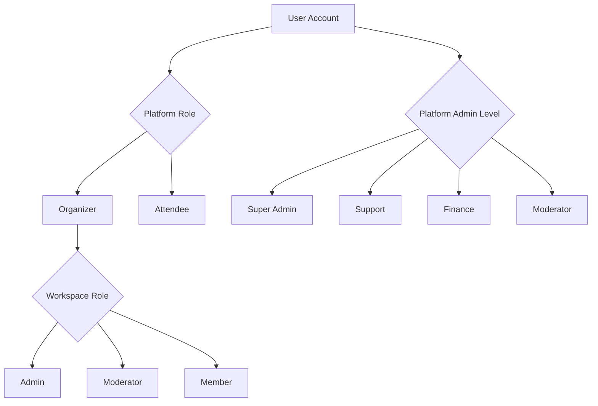

## Overview

EventPalour implements a multi-layered role system with three distinct permission scopes: Platform Roles, Platform Admin Levels, and Workspace Roles. Each scope serves different purposes in the system's security and access control.

## Role Hierarchy



## Platform Roles

Platform roles define the primary user type at the application level. Every user has one platform role.

```typescript
// From /lib/db/schema/enums.ts:11-14
enum PlatformRole {
  ORGANIZER = "organizer",      // Can create and manage workspaces/events
  ATTENDEE = "attendee"         // Can discover and attend events
}
```

<CardGroup cols={2}>
  <Card title="Organizer" icon="users">
    Users who create and manage events. Can create workspaces, organize events, sell tickets, and build teams.
  </Card>
  <Card title="Attendee" icon="user">
    Users who discover and attend events. Can browse events, purchase tickets, and register for events.
  </Card>
</CardGroup>

### Platform Role Assignment

The platform role is stored in the `user` table:

```typescript
// From /lib/db/schema/user.ts:27
user {
  platform_role: platform_role_enum  // Can be null, "organizer", or "attendee"
}
```

<Info>
Users typically choose their platform role during onboarding. Organizers are guided to create their first workspace.
</Info>

### Role Capabilities

| Capability | Organizer | Attendee |
|------------|-----------|----------|
| Create workspaces | ✅ | ❌ |
| Create events | ✅ | ❌ |
| Manage tickets | ✅ | ❌ |
| Invite team members | ✅ | ❌ |
| Browse events | ✅ | ✅ |
| Purchase tickets | ✅ | ✅ |
| Register for events | ✅ | ✅ |
| Attend events | ✅ | ✅ |

<Note>
A user can have both roles functionally. An organizer can also attend other events as an attendee.
</Note>

## Platform Admin Levels

Platform admins have elevated privileges for managing the entire EventPalour platform. These are internal staff roles, separate from regular users.

```typescript
// From /lib/db/schema/enums.ts:16-21
enum AdminLevel {
  SUPER_ADMIN = "super_admin",  // Platform owners/administrators
  SUPPORT = "support",          // Customer support team
  FINANCE = "finance",          // Finance team for revenue management
  MODERATOR = "moderator"       // Content moderation
}
```

### Admin Schema

Platform admins are stored in the `platform_admins` table:

```typescript
// From /lib/db/schema/platform-admin.ts:6-12
type PlatformAdminPermissions = {
  canManageAdmins?: boolean;
  canManageUsers?: boolean;
  canManageWorkspaces?: boolean;
  canViewAuditLogs?: boolean;
  canManageKYC?: boolean;
};

platformAdmins {
  id: varchar(16),
  userId: varchar(16),                               // Reference to user
  adminLevel: admin_level_enum,                      // Default: "super_admin"
  permissions: jsonb<PlatformAdminPermissions>,      // Granular permissions
  createdAt: timestamp,
  updatedAt: timestamp
}
```

<Warning>
Platform admin access is highly privileged. Only grant these roles to trusted internal team members.
</Warning>

### Admin Level Responsibilities

<Tabs>
  <Tab title="Super Admin">
    **Full System Access**
    
    - Manage all platform admins
    - Access all workspaces and events
    - Modify system settings
    - View all audit logs
    - Override any restrictions
    
    Use case: Platform owners and technical administrators
  </Tab>
  
  <Tab title="Support">
    **Customer Support**
    
    - View user accounts and workspaces
    - Assist with account issues
    - Handle user inquiries
    - Cannot modify financial data
    - Limited access to sensitive operations
    
    Use case: Customer support team members
  </Tab>
  
  <Tab title="Finance">
    **Revenue Management**
    
    - View payment data
    - Process refunds
    - Manage KYC verifications
    - Generate financial reports
    - Cannot modify user content
    
    Use case: Finance and accounting team
  </Tab>
  
  <Tab title="Moderator">
    **Content Moderation**
    
    - Review reported events
    - Remove inappropriate content
    - Suspend violating workspaces
    - Cannot access financial data
    - Cannot manage other admins
    
    Use case: Content moderation team
  </Tab>
</Tabs>

### Granular Permissions

The `permissions` JSONB field allows fine-grained access control:

```json
{
  "canManageAdmins": true,        // Create/modify admin accounts
  "canManageUsers": true,         // Suspend/modify user accounts
  "canManageWorkspaces": true,    // Access all workspaces
  "canViewAuditLogs": true,       // View system audit logs
  "canManageKYC": true            // Approve/reject KYC submissions
}
```

<Info>
Permissions can be customized per admin. A support team lead might have `canManageUsers: true` while regular support staff have it set to `false`.
</Info>

## Workspace Roles

Within each workspace, members are assigned roles that control their access to workspace resources.

```typescript
// From /lib/db/schema/enums.ts:23-27
enum WorkspaceRole {
  ADMIN = "admin",
  MODERATOR = "moderator",
  MEMBER = "member"
}
```

### Workspace Role Assignment

Roles are assigned in the `workspace_members` table:

```typescript
// From /lib/db/schema/workspace.ts:49
workspace_members {
  role: workspace_role_enum  // Default: "member"
}
```

### Workspace Role Matrix

| Permission | Admin | Moderator | Member |
|------------|-------|-----------|--------|
| **Workspace Management** |
| Edit workspace settings | ✅ | ❌ | ❌ |
| Delete workspace | ✅ | ❌ | ❌ |
| Manage invite codes | ✅ | ❌ | ❌ |
| **Member Management** |
| Invite members | ✅ | ❌ | ❌ |
| Remove members | ✅ | ❌ | ❌ |
| Change member roles | ✅ | ❌ | ❌ |
| **Event Management** |
| Create events | ✅ | ✅ | ❌ |
| Edit events | ✅ | ✅ | ❌ |
| Delete events | ✅ | ✅ | ❌ |
| Manage event categories | ✅ | ✅ | ❌ |
| **Ticket Management** |
| Create ticket types | ✅ | ✅ | ❌ |
| Configure tickets | ✅ | ✅ | ❌ |
| View ticket sales | ✅ | ✅ | ❌ |
| Process refunds | ✅ | ❌ | ❌ |
| **Content Management** |
| Manage speakers | ✅ | ✅ | ❌ |
| Publish announcements | ✅ | ✅ | ❌ |
| Moderate channels | ✅ | ✅ | ❌ |
| **Read Access** |
| View workspace | ✅ | ✅ | ✅ |
| View events | ✅ | ✅ | ✅ |
| View channels | ✅ | ✅ | ✅ |
| Participate in channels | ✅ | ✅ | ✅ |

<CardGroup cols={3}>
  <Card title="Admin" icon="crown">
    Full control over the workspace including settings, members, events, and financial operations.
  </Card>
  <Card title="Moderator" icon="shield">
    Can manage events and content but cannot modify workspace settings or manage members.
  </Card>
  <Card title="Member" icon="user">
    Read-only access to workspace resources. Can participate but not manage.
  </Card>
</CardGroup>

## Special Workspace Relationships

### Workspace Owner

The user who creates a workspace is stored in `workspace.user_id`:

```typescript
// From /lib/db/schema/workspace.ts:23-25
workspace {
  user_id: varchar(16)  // Creator/owner of workspace
}
```

<Note>
The workspace owner has implicit admin privileges even if not explicitly listed in `workspace_members`. Deleting the owner account cascades to delete the workspace.
</Note>

### Multiple Workspace Memberships

Users can be members of multiple workspaces with different roles:

```typescript
// Example: User's memberships
[
  { workspace_id: "ws1", role: "admin" },     // Admin in workspace 1
  { workspace_id: "ws2", role: "moderator" }, // Moderator in workspace 2
  { workspace_id: "ws3", role: "member" }     // Member in workspace 3
]
```

## Role Assignment Workflows

### Platform Role Selection

<Steps>
  <Step title="User Signs Up">
    New user creates account via email or OAuth.
  </Step>
  <Step title="Onboarding">
    User is asked: "Are you an event organizer or attendee?"
  </Step>
  <Step title="Set Platform Role">
    System updates `user.platform_role` to selected value.
  </Step>
  <Step title="Route User">
    - Organizer → Create workspace flow
    - Attendee → Event discovery page
  </Step>
</Steps>

### Workspace Invitation

<Steps>
  <Step title="Admin Sends Invite">
    Workspace admin creates invitation with desired role.
  </Step>
  <Step title="Recipient Receives Email">
    Email contains unique invitation link with token.
  </Step>
  <Step title="Accept Invitation">
    User clicks link and accepts invitation.
  </Step>
  <Step title="Create Membership">
    System creates `workspace_members` record with specified role.
  </Step>
</Steps>

### Platform Admin Assignment

<Warning>
This should only be done by existing super admins through a secure admin interface.
</Warning>

<Steps>
  <Step title="Super Admin Access">
    Super admin accesses admin management panel.
  </Step>
  <Step title="Select User">
    Choose user account to grant admin access.
  </Step>
  <Step title="Configure Admin">
    Set admin level and configure granular permissions.
  </Step>
  <Step title="Create Admin Record">
    System creates `platform_admins` record.
  </Step>
  <Step title="Audit Log">
    Admin creation is logged in audit log.
  </Step>
</Steps>

## Permission Checking

### Checking Platform Role

```typescript
function canCreateWorkspace(user: User): boolean {
  return user.platform_role === 'organizer';
}
```

### Checking Workspace Role

```typescript
function canManageEvent(userId: string, workspaceId: string): boolean {
  const membership = getWorkspaceMembership(userId, workspaceId);
  return membership?.role === 'admin' || membership?.role === 'moderator';
}
```

### Checking Platform Admin

```typescript
function canManageKYC(userId: string): boolean {
  const admin = getPlatformAdmin(userId);
  if (!admin) return false;
  
  return admin.adminLevel === 'super_admin' ||
         admin.adminLevel === 'finance' ||
         admin.permissions?.canManageKYC === true;
}
```

## Best Practices

<AccordionGroup>
  <Accordion title="Principle of Least Privilege">
    Always assign the minimum role required:
    - Default workspace invitations to "member"
    - Only promote to "moderator" or "admin" when necessary
    - Regularly audit admin permissions
  </Accordion>
  
  <Accordion title="Role Transitions">
    Document when users should be promoted:
    - Member → Moderator: Trusted contributor managing content
    - Moderator → Admin: Team lead with financial responsibility
    - User → Platform Admin: Internal staff only
  </Accordion>
  
  <Accordion title="Separation of Concerns">
    Keep roles separate:
    - Platform roles define user type (organizer/attendee)
    - Workspace roles define workspace access
    - Admin levels define platform management access
  </Accordion>
  
  <Accordion title="Audit Trail">
    Log all role changes:
    - Track who granted admin access
    - Record permission modifications
    - Monitor privilege escalation
  </Accordion>
  
  <Accordion title="Owner Protection">
    Protect workspace owners:
    - Prevent owner from being removed as member
    - Require ownership transfer before deletion
    - Cascade delete workspace if owner account deleted
  </Accordion>
</AccordionGroup>

## Common Scenarios

### Scenario 1: Solo Organizer

```typescript
User: {
  platform_role: "organizer",
  platform_admin: null
}

Workspace "Tech Events": {
  user_id: user.id,           // Owner
  members: []                 // No additional members
}
```

Solo organizer creates workspace, owns it implicitly, manages all events alone.

### Scenario 2: Team of Organizers

```typescript
Workspace "Conference Co": {
  user_id: "alice",           // Owner (Alice)
  members: [
    { user_id: "bob", role: "admin" },       // Co-organizer
    { user_id: "carol", role: "moderator" }, // Content manager
    { user_id: "dave", role: "member" }      // Viewer
  ]
}
```

Alice owns workspace, Bob co-manages, Carol handles content, Dave observes.

### Scenario 3: Platform Administrator

```typescript
User: {
  platform_role: "organizer",        // Can also organize events
  platform_admin: {
    adminLevel: "support",
    permissions: {
      canManageUsers: false,         // Cannot modify users
      canViewAuditLogs: true         // Can view logs
    }
  }
}
```

Internal support staff with platform access and ability to organize their own events.

## Technical Details

### Schema Locations

```
/lib/db/schema/enums.ts           # Role enum definitions
/lib/db/schema/user.ts            # Platform role assignment
/lib/db/schema/workspace.ts       # Workspace roles
/lib/db/schema/platform-admin.ts  # Platform admin levels
```

### Key Relationships

Defined in `/lib/db/schema/relations.ts`:

- User has one platform admin record (one-to-one)
- User has many workspace memberships (one-to-many)
- Workspace has many members (one-to-many)
- Platform admin belongs to user (many-to-one)