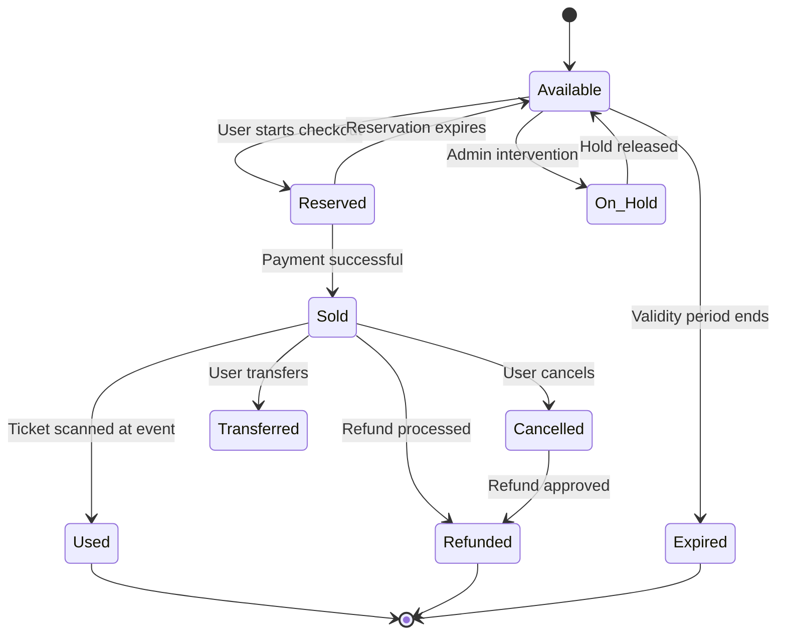
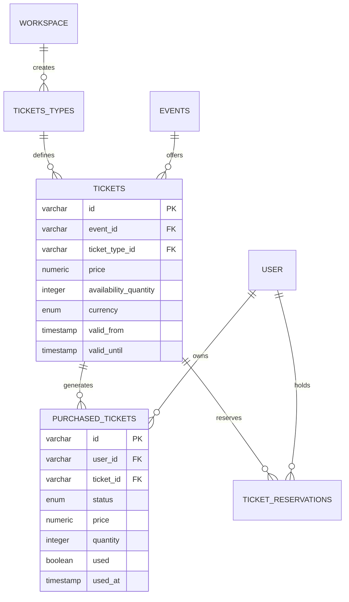

## Overview

EventPalour's ticketing system supports multiple ticket types per event with flexible pricing, availability controls, and comprehensive status tracking. The system handles both ticket definitions and purchased ticket instances.

## Ticket Architecture

The ticketing system consists of three main components:

1. **Ticket Types**: Reusable ticket type definitions (e.g., "VIP", "Early Bird")
2. **Tickets**: Event-specific ticket configurations with pricing and availability
3. **Purchased Tickets**: Individual ticket instances owned by users

## Ticket Types

Ticket types are workspace-level templates defined in `tickets_types` table:

```typescript
{
  id: varchar(16),              // Ticket type ID
  workspace_id: varchar(16),    // Owner workspace
  name: varchar(255),           // Type name (e.g., "VIP", "Early Bird", "Standard")
  created_at: timestamp,
  updated_at: timestamp
}
```

<Info>
Ticket types are reusable across all events in a workspace. Create types once and apply them to multiple events.
</Info>

### Common Ticket Types

<CardGroup cols={2}>
  <Card title="VIP" icon="crown">
    Premium access with exclusive benefits
  </Card>
  <Card title="Early Bird" icon="clock">
    Discounted tickets for early registrations
  </Card>
  <Card title="Standard" icon="ticket">
    Regular admission tickets
  </Card>
  <Card title="Student" icon="graduation-cap">
    Discounted tickets for students
  </Card>
</CardGroup>

## Tickets Schema

The `tickets` table defines event-specific ticket configurations:

| Field | Type | Description |
|-------|------|-------------|
| `id` | varchar(16) | Unique ticket ID |
| `event_id` | varchar(16) | Associated event (foreign key) |
| `ticket_type_id` | varchar(16) | Ticket type (foreign key) |
| `price` | numeric(10, 2) | Ticket price |
| `availability_quantity` | integer | Max tickets (NULL = unlimited) |
| `currency` | currency_enum | Price currency (default: "KES") |
| `valid_from` | timestamp | Sales start time (with timezone) |
| `valid_until` | timestamp | Sales end time (with timezone) |
| `created_at` | timestamp | Creation timestamp |
| `updated_at` | timestamp | Last update timestamp |

<Note>
Tickets connect event-specific configurations (price, availability) with workspace-level ticket types (name, category).
</Note>

## Currency Support

Currently supported currencies:

```typescript
// From /lib/db/schema/enums.ts:85-88
enum CurrencyEnum {
  USD = "USD",
  KES = "KES"   // Kenyan Shilling (default)
}
```

## Availability Management

### Unlimited Tickets

Set `availability_quantity` to `NULL` for unlimited ticket sales:

```typescript
const unlimitedTicket = {
  event_id: "evt123",
  ticket_type_id: "standard",
  price: 1000.00,
  availability_quantity: null,  // Unlimited
  currency: "KES"
};
```

### Limited Tickets

Set a specific number for capacity-limited events:

```typescript
const limitedTicket = {
  event_id: "evt123",
  ticket_type_id: "vip",
  price: 5000.00,
  availability_quantity: 50,    // Only 50 VIP tickets
  currency: "KES"
};
```

<Warning>
Always check available quantity before allowing purchases. Implement race condition protection for high-demand events.
</Warning>

## Time-based Availability

Control when tickets can be purchased using `valid_from` and `valid_until`:

<CodeGroup>
```typescript Early Bird
const earlyBirdTicket = {
  ticket_type_id: "early_bird",
  price: 800.00,
  valid_from: new Date('2024-01-01T00:00:00Z'),
  valid_until: new Date('2024-01-31T23:59:59Z')  // Available only in January
};
```

```typescript Last Minute
const lastMinuteTicket = {
  ticket_type_id: "standard",
  price: 1200.00,
  valid_from: new Date('2024-03-15T00:00:00Z'),  // Available 2 days before event
  valid_until: null  // Until event starts
};
```
</CodeGroup>

## Purchased Tickets

When users buy tickets, instances are created in `purchased_tickets`:

| Field | Type | Description |
|-------|------|-------------|
| `id` | varchar(16) | Purchased ticket ID |
| `user_id` | varchar(16) | Ticket owner |
| `ticket_id` | varchar(16) | Reference to ticket definition |
| `status` | ticket_status_enum | Current status (default: "sold") |
| `price` | numeric(10, 2) | Actual purchase price |
| `quantity` | integer | Number of tickets purchased |
| `used` | boolean | Whether ticket was scanned (default: false) |
| `used_at` | timestamp | Scan/redemption timestamp |
| `created_at` | timestamp | Purchase timestamp |
| `updated_at` | timestamp | Last update timestamp |

## Ticket Status Lifecycle

Purchased tickets transition through various statuses:



### Status Definitions

```typescript
// From /lib/db/schema/enums.ts:42-52
enum TicketStatus {
  AVAILABLE = "available",      // Ready for purchase
  RESERVED = "reserved",        // Temporarily held during checkout
  SOLD = "sold",                // Successfully purchased
  CANCELLED = "cancelled",      // Cancelled by user
  REFUNDED = "refunded",        // Refund processed
  TRANSFERRED = "transferred",  // Transferred to another user
  USED = "used",                // Scanned/redeemed at event
  EXPIRED = "expired",          // Past validity period
  ON_HOLD = "on_hold"          // Administrative hold
}
```

<Tabs>
  <Tab title="Available">
    Ticket is ready for purchase. Default state for ticket inventory.
  </Tab>
  <Tab title="Reserved">
    Temporarily held during checkout process. Should expire after 10-15 minutes if payment not completed.
  </Tab>
  <Tab title="Sold">
    Payment successful. Ticket owned by user.
  </Tab>
  <Tab title="Cancelled">
    User cancelled before the event. May be eligible for refund.
  </Tab>
  <Tab title="Refunded">
    Refund has been processed. Cannot be used.
  </Tab>
  <Tab title="Transferred">
    Ownership transferred to another user.
  </Tab>
  <Tab title="Used">
    Ticket was scanned at the event entrance.
  </Tab>
  <Tab title="Expired">
    Past the validity period. Cannot be used.
  </Tab>
  <Tab title="On Hold">
    Administratively frozen, usually pending investigation.
  </Tab>
</Tabs>

## Ticket Reservations

The `ticket_reservations` table manages temporary holds during checkout:

```typescript
{
  id: varchar(16),              // Reservation ID
  ticket_id: varchar(16),       // Reserved ticket
  user_id: varchar(16),         // User holding reservation
  quantity: integer,            // Number reserved (default: 1)
  expires_at: timestamp,        // Expiration time (with timezone)
  created_at: timestamp         // When reservation was made
}
```

<Steps>
  <Step title="Create Reservation">
    When user begins checkout, create reservation to hold tickets.
  </Step>
  <Step title="Set Expiration">
    Set `expires_at` to 10-15 minutes from creation.
  </Step>
  <Step title="Complete Purchase">
    If payment succeeds, create `purchased_tickets` and delete reservation.
  </Step>
  <Step title="Handle Expiration">
    If payment times out, delete expired reservation to release tickets.
  </Step>
</Steps>

<Warning>
Implement a background job to clean up expired reservations and return tickets to available inventory.
</Warning>

## Ticket Relationships



## Ticket Transfers

Users can transfer tickets to others via `ticket_transfers`:

```typescript
{
  id: varchar(16),
  purchased_ticket_id: varchar(16),     // Which ticket is being transferred
  from_user_id: varchar(16),            // Current owner
  to_user_id: varchar(16),              // New owner
  transferred_at: timestamp             // Transfer timestamp
}
```

<Info>
When a transfer completes, update the `purchased_tickets.user_id` to the new owner and set status to `TRANSFERRED`.
</Info>

## Ticket Scanning

Track ticket redemption at event entrances using `ticket_scans`:

```typescript
{
  id: varchar(16),
  purchased_ticket_id: varchar(16),     // Which ticket was scanned
  scanned_by_user_id: varchar(16),      // Staff member who scanned (optional)
  scanned_at: timestamp                 // Scan timestamp
}
```

<Note>
The table has a unique constraint on `purchased_ticket_id` to prevent double-scanning. Each ticket can only be scanned once.
</Note>

## Pricing Strategies

### Tiered Pricing

Create multiple tickets for the same event with different prices:

```typescript
const tickets = [
  {
    ticket_type_id: "early_bird",
    price: 500.00,
    availability_quantity: 100,
    valid_from: '2024-01-01',
    valid_until: '2024-01-31'
  },
  {
    ticket_type_id: "standard",
    price: 800.00,
    availability_quantity: 200,
    valid_from: '2024-02-01',
    valid_until: '2024-03-15'
  },
  {
    ticket_type_id: "vip",
    price: 2000.00,
    availability_quantity: 50,
    valid_from: '2024-01-01',
    valid_until: '2024-03-15'
  }
];
```

### Dynamic Pricing

Adjust prices based on demand by creating new ticket records:

1. Set `valid_until` on current tickets to end availability
2. Create new tickets with updated prices
3. Set `valid_from` to when new pricing takes effect

## Best Practices

<AccordionGroup>
  <Accordion title="Inventory Management">
    - Use database transactions when decrementing `availability_quantity`
    - Implement optimistic locking to prevent overselling
    - Monitor inventory levels and alert when running low
  </Accordion>
  
  <Accordion title="Reservation Expiry">
    - Set reasonable expiration times (10-15 minutes)
    - Run cleanup jobs every 1-2 minutes to release expired reservations
    - Notify users before their reservation expires
  </Accordion>
  
  <Accordion title="Status Transitions">
    Validate status changes:
    - `RESERVED` → `SOLD` (only if payment succeeds)
    - `SOLD` → `USED` (only at event time, with proper authentication)
    - `SOLD` → `REFUNDED` (only within refund policy window)
  </Accordion>
  
  <Accordion title="Price History">
    Store the actual purchase price in `purchased_tickets.price`. Never reference the current ticket price for historical purchases.
  </Accordion>
  
  <Accordion title="Currency Handling">
    - Always specify currency when displaying prices
    - Store all prices as decimal(10, 2) for precision
    - Handle currency conversions at application level if needed
  </Accordion>
</AccordionGroup>

## Common Queries

<CodeGroup>
```sql Available Tickets
-- Get available tickets for an event
SELECT 
  t.*,
  tt.name as ticket_type_name,
  COALESCE(t.availability_quantity - COUNT(pt.id), t.availability_quantity) as remaining
FROM tickets t
JOIN tickets_types tt ON t.ticket_type_id = tt.id
LEFT JOIN purchased_tickets pt ON t.id = pt.ticket_id 
  AND pt.status IN ('sold', 'reserved')
WHERE t.event_id = 'evt123'
  AND (t.valid_from IS NULL OR t.valid_from <= NOW())
  AND (t.valid_until IS NULL OR t.valid_until >= NOW())
GROUP BY t.id, tt.name;
```

```sql User's Tickets
-- Get all tickets for a user
SELECT 
  pt.*,
  t.price as current_price,
  tt.name as ticket_type,
  e.title as event_title,
  e.start_date
FROM purchased_tickets pt
JOIN tickets t ON pt.ticket_id = t.id
JOIN tickets_types tt ON t.ticket_type_id = tt.id
JOIN events e ON t.event_id = e.id
WHERE pt.user_id = 'user123'
  AND pt.status NOT IN ('cancelled', 'refunded')
ORDER BY e.start_date DESC;
```
</CodeGroup>

## Technical Details

### Schema Location

```
/lib/db/schema/tickets.ts
/lib/db/schema/ticket_reservations.ts
/lib/db/schema/attendee.ts (purchased_tickets)
/lib/db/schema/enums.ts
```

### Key Relationships

Defined in `/lib/db/schema/relations.ts:95-119, 254-265`:

- Tickets belong to events and ticket types
- Purchased tickets belong to users and reference tickets
- Reservations temporarily hold tickets for users
- Transfers track ownership changes