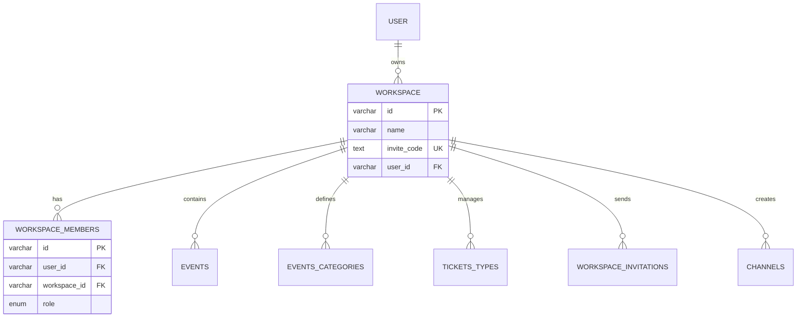

## Overview

Workspaces are the foundation of EventPalour's multi-tenancy architecture. Each workspace represents an isolated environment where organizations can manage their events, team members, and event-related resources.

<Info>
Think of a workspace as your organization's dedicated event management hub. All events, tickets, and team collaboration happen within the context of a workspace.
</Info>

## Data Model

### Workspace Schema

The workspace table contains the following key fields:

| Field | Type | Description |
|-------|------|-------------|
| `id` | varchar(16) | Unique workspace identifier (auto-generated) |
| `name` | varchar(255) | Display name of the workspace |
| `description` | text | Optional workspace description |
| `image_url` | text | Workspace logo/avatar URL |
| `invite_code` | text | Unique code for inviting members (unique, indexed) |
| `user_id` | varchar(16) | Owner's user ID (foreign key to user table) |
| `website` | varchar(255) | Organization website |
| `phone` | varchar(50) | Contact phone number |
| `social_x` | varchar(255) | X (Twitter) profile URL |
| `social_facebook` | varchar(255) | Facebook profile URL |
| `social_linkedin` | varchar(255) | LinkedIn profile URL |
| `social_instagram` | varchar(255) | Instagram profile URL |
| `social_github` | varchar(255) | GitHub profile URL |
| `created_at` | timestamp | Workspace creation timestamp |
| `updated_at` | timestamp | Last update timestamp |

### Workspace Members

Members are managed through the `workspace_members` table:

```typescript
{
  id: varchar(16),              // Member record ID
  user_id: varchar(16),         // Reference to user
  workspace_id: varchar(16),    // Reference to workspace
  role: workspace_role_enum     // Member's role (default: "member")
}
```

## Workspace Roles

Each workspace member has one of three roles:

<CardGroup cols={3}>
  <Card title="Admin" icon="crown">
    Full workspace access including member management, settings, and all event operations.
  </Card>
  <Card title="Moderator" icon="shield">
    Can manage events and content but cannot modify workspace settings or manage members.
  </Card>
  <Card title="Member" icon="user">
    Basic access to view events and participate in workspace activities.
  </Card>
</CardGroup>

<Note>
Roles are defined in `/lib/db/schema/enums.ts` as:
```typescript
enum WorkspaceRole {
  ADMIN = "admin",
  MODERATOR = "moderator",
  MEMBER = "member"
}
```
</Note>

## Workspace Relationships

A workspace is connected to multiple entities:



## Workspace Invitations

Workspaces can invite new members via the `workspace_invitations` table:

| Field | Type | Description |
|-------|------|-------------|
| `id` | varchar(16) | Invitation ID |
| `workspace_id` | varchar(16) | Target workspace |
| `email` | varchar(255) | Invitee's email address |
| `role` | workspace_role_enum | Role to assign (default: "member") |
| `invited_by` | varchar(16) | User who sent the invitation |
| `token` | varchar(64) | Unique invitation token |
| `accepted` | boolean | Acceptance status (default: false) |
| `expires_at` | timestamp | Expiration timestamp |

<Warning>
Invitation tokens are single-use and expire after a set period. The system tracks both workspace ID and email in a composite index for efficient lookups.
</Warning>

## Multi-Tenancy Architecture

EventPalour uses workspace-based multi-tenancy where:

1. **Data Isolation**: All events, categories, and ticket types are scoped to a workspace
2. **Team Collaboration**: Multiple users can be members of the same workspace
3. **Resource Ownership**: Each workspace has a single owner (creator) but can have multiple admins
4. **Invite-based Access**: Users join workspaces through unique invite codes or email invitations

## Common Use Cases

### Creating a Workspace

When a user signs up as an organizer, they're prompted to create their first workspace:

```typescript
const workspace = {
  name: "Tech Conference Co",
  description: "Annual technology conferences",
  user_id: currentUser.id,
  invite_code: generateUniqueCode(),
  image_url: uploadedLogoUrl
};
```

### Inviting Team Members

<Steps>
  <Step title="Send Invitation">
    Admin creates an invitation with the target email and desired role.
  </Step>
  <Step title="Email Notification">
    System sends invitation email with unique token link.
  </Step>
  <Step title="Accept Invitation">
    Recipient clicks link and accepts the invitation.
  </Step>
  <Step title="Join Workspace">
    System creates `workspace_members` record with specified role.
  </Step>
</Steps>

### Managing Multiple Workspaces

Users can be members of multiple workspaces with different roles:

- Owner of "Tech Conference Co" (as creator)
- Admin in "DevOps Meetup Group"
- Member in "Community Events Hub"

## Best Practices

<AccordionGroup>
  <Accordion title="Workspace Naming">
    Use clear, descriptive names that reflect your organization or event series. Names are displayed throughout the platform and in public event pages.
  </Accordion>
  
  <Accordion title="Invite Code Security">
    Treat invite codes as sensitive. They provide direct access to your workspace. Rotate codes if they're accidentally exposed.
  </Accordion>
  
  <Accordion title="Role Assignment">
    Follow the principle of least privilege. Start members with the "member" role and promote to "moderator" or "admin" as needed.
  </Accordion>
  
  <Accordion title="Social Links">
    Complete all relevant social media fields to enhance your workspace's public profile and improve discoverability.
  </Accordion>
</AccordionGroup>

## Technical Details

### Schema Location

```
/lib/db/schema/workspace.ts
```

### Database Constraints

- `invite_code` has a unique constraint and index for fast lookups
- `user_id` cascades on delete (deleting owner deletes workspace)
- All member and invitation relationships cascade on workspace deletion

### Automatic Fields

- `id` is auto-generated using nano ID (16 characters)
- `created_at` defaults to current timestamp
- `updated_at` automatically updates on record modification