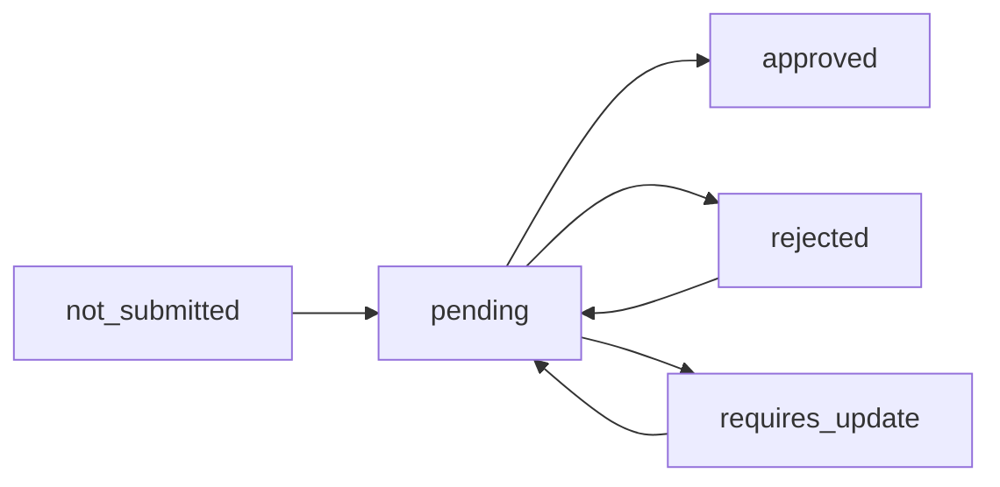

KYC (Know Your Customer) verification is required for event organizers who want to create paid events and receive payments on EventPalour. This guide walks you through the complete verification process.

## Why KYC is Required

KYC verification ensures:

- **Secure Payments**: Protects both organizers and attendees from fraud
- **Compliance**: Meets financial regulations and anti-money laundering requirements
- **Trust**: Builds confidence in the platform for all users
- **Payouts**: Enables you to receive event revenue to your account

<Note>
  You can create **free events** without KYC verification. KYC is only required when you want to sell paid tickets.
</Note>

## KYC Status Flow

Your KYC application moves through these statuses:



### Status Definitions

**not_submitted**
- Initial status for all organizers
- No KYC application on file
- Cannot create paid events
- Action: Submit KYC application

**pending**
- Application submitted and under review
- Review typically takes 1-3 business days
- Cannot create paid events yet
- Action: Wait for review completion

**approved**
- Verification completed successfully
- Can create paid events
- Can receive payouts
- Action: Start creating paid events

**rejected**
- Application did not meet requirements
- Cannot create paid events
- Reason provided via email
- Action: Review feedback and resubmit with corrections

**requires_update**
- Additional information or documents needed
- Specific requirements sent via email
- Cannot create paid events until updated
- Action: Submit requested updates

## Required Documents

You must provide valid identification documents from these categories:

### Individual Organizers

**Primary Identification (Choose ONE):**

<AccordionGroup>
  <Accordion title="National ID" icon="id-card">
    **Requirements:**
    - Government-issued national identity card
    - Must be current and not expired
    - Clear photo of both front and back
    
    **Document Type in System:**
    ```
    id_type: "national_id"
    ```
    
    **What to Upload:**
    - Front: Photo with your picture and personal details
    - Back: Additional information and signature
    
    **File Requirements:**
    - Format: JPG, PNG, or PDF
    - Size: Maximum 10MB per file
    - Quality: All text must be clearly readable
    - No glare or shadows
  </Accordion>

  <Accordion title="Passport" icon="passport">
    **Requirements:**
    - International passport
    - Must be current and not expired
    - Photo page clearly visible
    
    **Document Type in System:**
    ```
    id_type: "passport"
    ```
    
    **What to Upload:**
    - Photo page showing:
      - Your photograph
      - Full name
      - Date of birth
      - Passport number
      - Expiry date
    
    **File Requirements:**
    - Format: JPG, PNG, or PDF
    - Size: Maximum 10MB
    - Quality: High resolution, all details readable
  </Accordion>

  <Accordion title="Driver's License" icon="car">
    **Requirements:**
    - Valid driver's license
    - Not expired
    - Photo clearly visible
    
    **Document Type in System:**
    ```
    id_type: "driver_license"
    ```
    
    **What to Upload:**
    - Front: Photo, name, license number
    - Back: Additional details and endorsements
    
    **File Requirements:**
    - Format: JPG, PNG, or PDF
    - Size: Maximum 10MB per file
    - Quality: All text legible
  </Accordion>
</AccordionGroup>

### Business/Organization Organizers

If organizing on behalf of a business or organization, also provide:

**Business Registration**
- Certificate of incorporation
- Business registration certificate
- Trade license

**Tax Identification**
- Tax ID number (KRA PIN for Kenya)
- Tax registration certificate

<Warning>
  All documents must be:
  - Valid and not expired
  - Issued by government authorities
  - Matching the name on your EventPalour account
  - Clear and fully readable
</Warning>

## Submitting Your KYC Application

<Steps>
  <Step title="Access KYC Page">
    Navigate to the KYC verification page:
    
    **From Workspace:**
    ```
    1. Go to your workspace dashboard
    2. Click "KYC Verification" in the sidebar
    3. Or navigate to: /workspace/{workspaceId}/kyc
    ```
    
    **From Event Creation:**
    If you try to create a paid event without KYC:
    ```
    1. Pricing options will show "Paid" as disabled
    2. Click "Complete KYC" link
    3. Redirected to KYC page
    ```
  </Step>

  <Step title="Fill Personal Information">
    Complete all required fields:
    
    ### First Name
    ```
    Example: "John"
    ```
    - Must match ID document
    - No special characters
    
    ### Last Name
    ```
    Example: "Doe"
    ```
    - Must match ID document
    - No special characters
    
    ### Phone Number
    ```
    Example: "+254712345678"
    ```
    - Include country code
    - Format: +[country code][number]
    - Used for verification if needed
    
    ### Date of Birth
    ```
    Example: 1990-05-15
    ```
    - Must be 18 years or older
    - Format: YYYY-MM-DD
    - Must match ID document
    
    <Note>
      All information must exactly match your identification documents. Discrepancies will result in rejection.
    </Note>
  </Step>

  <Step title="Select ID Type">
    Choose your primary identification document:
    
    **Options:**
    - National ID (`national_id`)
    - Passport (`passport`)
    - Driver's License (`driver_license`)
    
    ### ID Number
    Enter the identification number:
    ```
    Examples:
    - National ID: "12345678"
    - Passport: "A12345678"
    - Driver's License: "DL123456789"
    ```
    
    This will be used for verification against government databases.
  </Step>

  <Step title="Upload Documents">
    Upload your identity documents:
    
    ### Profile Image (Optional)
    - Recent photo of yourself
    - Format: JPG, PNG, WebP
    - Maximum size: 5MB
    - Clear face photo, good lighting
    
    ### Identity Documents (Required)
    Click "Upload Documents" to add files:
    
    **For National ID or Driver's License:**
    - Upload front side
    - Upload back side
    - 2 files minimum
    
    **For Passport:**
    - Upload photo page
    - Upload any additional information pages
    - 1-2 files typically
    
    **For Business Organizers (Additional):**
    - Business registration certificate
    - Tax ID certificate
    - Director/owner ID documents
    
    **File Requirements:**
    - **Formats**: JPG, PNG, PDF
    - **Size**: Maximum 10MB per file
    - **Quality**: High resolution, all text readable
    - **Multiple Files**: Upload all required documents
    
    ### Document Upload Process
    ```
    1. Click "Upload Documents" button
    2. Select files from your device
    3. Preview appears showing uploaded files
    4. For images: thumbnail preview shown
    5. For PDFs: "PDF" indicator shown
    6. Click X to remove any incorrect uploads
    7. Upload additional files as needed
    ```
    
    <Tip>
      Take photos in good lighting with a dark background. Ensure all four corners of the document are visible and there's no glare from flash.
    </Tip>
  </Step>

  <Step title="Review and Submit">
    Before submitting, verify:
    
    **Personal Information:**
    - ✓ Name matches ID exactly
    - ✓ Phone number is correct
    - ✓ Date of birth matches ID
    - ✓ ID type and number are accurate
    
    **Documents:**
    - ✓ All required documents uploaded
    - ✓ Documents are clear and readable
    - ✓ No expired documents
    - ✓ Files are under size limits
    
    **Submit Application:**
    ```
    1. Click "Submit Application" button
    2. System uploads all files (may take a moment)
    3. Success message appears
    4. Status changes to "pending"
    5. Confirmation email sent
    ```
    
    After submission:
    - Cannot edit application while pending
    - Receive email confirmation
    - Review typically takes 1-3 business days
    - Receive email notification of decision
  </Step>
</Steps>

## After Submission

### Pending Review

While your application is under review:

**What Happens:**
- EventPalour team reviews your application
- Documents verified for authenticity
- Information cross-checked
- Compliance checks performed

**Timeline:**
- **Standard Review**: 1-3 business days
- **Peak Periods**: Up to 5 business days
- **Complex Cases**: May require additional time

**During This Time:**
- Cannot create paid events yet
- Can still create free events
- Can edit existing events
- Receive email updates on status

**Status Check:**
```
1. Go to /workspace/{workspaceId}/kyc
2. View current status: "Pending"
3. See "Application under review" message
4. Estimated review completion date shown
```

### Approved

Congratulations! Your verification is complete.

**Approval Email:**
You'll receive an email containing:
- Approval confirmation
- Next steps for creating paid events
- Payout setup instructions
- Support contact information

**What You Can Now Do:**
1. **Create Paid Events**
   - "Paid" pricing option now available
   - Configure ticket types and pricing
   - Accept payments from attendees

2. **Receive Payouts**
   - Set up your bank account details
   - Receive event revenue
   - View payout schedule

3. **Access Advanced Features**
   - Revenue analytics
   - Payout history
   - Tax reporting

**Status Display:**
```yaml
KYC Status: Approved ✓
Verified: [Date]
Next Action: Start creating paid events
```

### Rejected

Your application did not meet verification requirements.

**Rejection Email:**
You'll receive detailed feedback:
- Specific reasons for rejection
- Which documents/information need correction
- Instructions for resubmission
- Support contact for questions

**Common Rejection Reasons:**

<AccordionGroup>
  <Accordion title="Expired Documents">
    **Problem:** ID or passport has expired
    
    **Solution:**
    - Obtain renewed/current identification
    - Upload updated documents
    - Resubmit application
  </Accordion>

  <Accordion title="Unclear/Unreadable Documents">
    **Problem:** Photos are blurry, has glare, or text is not legible
    
    **Solution:**
    - Retake photos in good lighting
    - Remove any glare (avoid flash)
    - Ensure all text is sharp and readable
    - Use high-resolution camera
    - Upload new clear images
  </Accordion>

  <Accordion title="Information Mismatch">
    **Problem:** Name/DOB on application doesn't match ID documents
    
    **Solution:**
    - Verify information on your ID
    - Update application to match exactly
    - Ensure no typos or extra spaces
    - Resubmit with correct information
  </Accordion>

  <Accordion title="Incomplete Documentation">
    **Problem:** Missing required documents (e.g., only front of ID uploaded)
    
    **Solution:**
    - Review document requirements
    - Upload all required files
    - For ID: both front and back
    - For business: all certificates
    - Resubmit complete application
  </Accordion>

  <Accordion title="Age Verification Failed">
    **Problem:** Date of birth shows under 18 years old
    
    **Solution:**
    - Must be 18+ to create paid events
    - Verify DOB on application matches ID
    - If under 18, cannot proceed with KYC
  </Accordion>
</AccordionGroup>

**Resubmitting After Rejection:**
```
1. Read rejection email carefully
2. Address all issues mentioned
3. Prepare corrected documents
4. Go to /workspace/{workspaceId}/kyc
5. Application form will be available again
6. Fill with corrected information
7. Upload new/corrected documents
8. Submit revised application
9. New review cycle begins (1-3 business days)
```

### Requires Update

Additional information or clarification needed.

**Update Request Email:**
You'll receive specific requests such as:
- Additional document needed (e.g., business license)
- Clearer photo of specific document
- Verification of certain information
- Additional proof of address

**Providing Updates:**
```
1. Go to /workspace/{workspaceId}/kyc
2. View "Requires Update" status
3. See specific requests listed
4. Upload requested documents
5. Provide requested information
6. Click "Submit Updates"
7. Status returns to "Pending"
8. Review continues (1-2 business days typically)
```

**Common Update Requests:**
- Business registration (if organizing as company)
- Tax ID certificate
- Proof of address
- Additional ID verification
- Clearer copy of existing document

## Security & Privacy

### Document Storage

Your KYC documents are:

**Encrypted:**
- Stored in secure encrypted storage
- Access restricted to compliance team only
- Never shared with third parties without consent

**Retained:**
- Kept for regulatory compliance period
- Automatically deleted after retention period
- You can request deletion (subject to legal requirements)

**Protected:**
- Industry-standard security measures
- Regular security audits
- Compliance with data protection regulations

### Privacy Compliance

EventPalour complies with:
- GDPR (General Data Protection Regulation)
- Local data protection laws
- Financial regulations
- Anti-money laundering requirements

**Your Rights:**
- Request copy of your data
- Request correction of inaccurate data
- Request deletion (after compliance period)
- Withdraw consent (may affect ability to create paid events)

## Payout Setup

After KYC approval, set up payouts:

<Steps>
  <Step title="Navigate to Billing">
    ```
    1. Go to workspace dashboard
    2. Click "Billing" in sidebar
    3. Or navigate to: /workspace/{workspaceId}/billing
    ```
  </Step>

  <Step title="Add Bank Account">
    Provide payout destination:
    
    **Required Information:**
    - Bank name
    - Account number
    - Account holder name (must match KYC name)
    - Branch code/routing number
    - Account type (checking/savings)
    
    **Verification:**
    - Small test deposit sent (KES 1-10)
    - Verify deposit amount in your account
    - Confirm amount in platform
    - Account verified
  </Step>

  <Step title="Configure Payout Schedule">
    Choose how often you receive payouts:
    
    **Options:**
    - **Automatic**: After each event (T+2 days)
    - **Weekly**: Every Monday
    - **Monthly**: 1st of each month
    - **Manual**: Request when ready
    
    **Processing Time:**
    - Paystack settlement: T+2 business days
    - Bank transfer: 1-3 business days
    - Total: 3-5 business days typically
  </Step>

  <Step title="Review Fees">
    Understand fee structure:
    
    **Payment Processing (Paystack):**
    ```
    3.9% + KES 100 per transaction
    ```
    
    **Platform Fee:**
    ```
    [Your platform percentage]% of ticket sales
    ```
    
    **Example Calculation:**
    ```yaml
    Ticket Price: KES 1,500
    Quantity Sold: 100 tickets
    Gross Revenue: KES 150,000
    
    Deductions:
      Payment Processing: (150,000 * 0.039) + (100 * 100) = KES 15,850
      Platform Fee: 150,000 * 0.05 = KES 7,500
      Total Deductions: KES 23,350
    
    Net Payout: KES 126,650
    ```
  </Step>
</Steps>

## Common Questions

**How long does KYC review take?**

Typically 1-3 business days. Complex cases or peak periods may take up to 5 business days.

**Can I create events while KYC is pending?**

Yes, you can create **free events**. Paid event creation is enabled only after approval.

**What if my ID is expiring soon?**

Submit with your current ID. You can update documents later when you renew your ID. IDs expiring within 30 days may be flagged for update.

**Do I need to verify for each workspace?**

KYC is tied to your user account, not individual workspaces. Once verified, you can create paid events in any workspace you own or manage.

**Can I use documents from different countries?**

Yes, as long as they are government-issued and valid. Passport is the most universally accepted.

**What if I don't have all required documents?**

You must have valid government-issued ID. For business organizers, business registration is required. Contact support if you have special circumstances.

**Can I update my KYC information later?**

Yes, navigate to the KYC page to update information. Some changes may require re-verification.

## Getting Help

If you need assistance with KYC:

**Support Channels:**
- Email: kyc@eventpalour.com
- In-app support chat
- Support ticket system

**Before Contacting Support:**
- Check rejection/update email for specific issues
- Review document requirements above
- Ensure all documents are clear and valid
- Have your application ID ready

**Response Time:**
- Email: Within 24 hours
- Chat: During business hours (9 AM - 6 PM EAT)
- Complex issues: Up to 48 hours

## Next Steps

After KYC approval:

<CardGroup cols={2}>
  <Card title="Creating Events" icon="calendar" href="/organizers/creating-events">
    Create your first paid event with ticket sales
  </Card>
  <Card title="Ticket Types" icon="ticket" href="/organizers/ticket-types">
    Set up ticket tiers and pricing strategies
  </Card>
  <Card title="Pricing Strategies" icon="chart-line" href="/organizers/pricing-strategies">
    Optimize pricing to maximize revenue
  </Card>
  <Card title="Attendee Management" icon="users" href="/organizers/attendee-management">
    Manage ticket sales and attendees
  </Card>
</CardGroup>